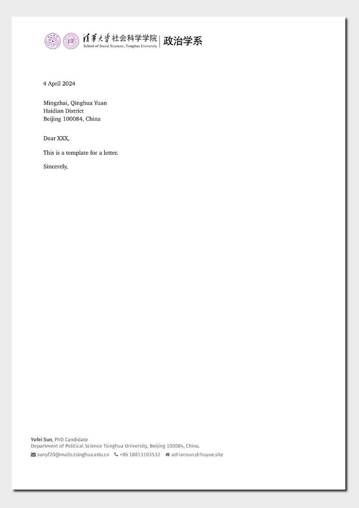

<!-- README.md is generated from README.qmd. Please edit that file -->

# THUpolisci Letter Format Template

This Quarto template enables you to create letters using the Tsinghua
University Political Science Department’s letterhead. It is developed
based on the `numbats/monash-quarto-letter` template, adapted to fit the
styling and formatting requirements of Tsinghua University.

## Creating a new letter

To start a new letter with this template, execute the following command:

``` bash
quarto use template syfyufei/THUpolisci-QuartoTemplete-letter
```

This command will install the template and generate a sample `.qmd`
file, which serves as a starting point for your letter.

## Installation for existing document

If you want to apply this letter format to an existing Quarto project or
document, navigate to the project or document’s directory and run the
following command:

``` bash
quarto install extension syfyufei/THUpolisci-QuartoTemplete-letter
```

This will integrate the Tsinghua University Political Science Department
letter format into your existing Quarto document.

## Example

Here is how the template looks when applied to a document:

[](examples/template.pdf)
